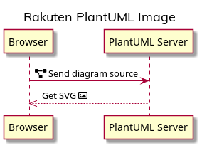

# plantuml-docker

[](https://github.com/orgs/rakutentech/packages/container/package/plantuml)
[](./CODE_OF_CONDUCT.md)

Docker image for running a PlantUML server.

## Usage

### Without cloning the repo

```sh
cat "read-packages personal access token.txt" | docker login ghcr.io -u "your-github-username" --password-stdin
docker pull ghcr.io/rakutentech/plantuml:main
docker run --init --rm -p 8080:8080 ghcr.io/rakutentech/plantuml:main
```

### Using a working copy of the repo

```sh
docker-compose up --build
```

## Differences with the official image

The differences with [plantuml/plantuml-server](https://hub.docker.com/r/plantuml/plantuml-server) are:

- Based on **Alpine Linux**, not Debian.
- Runs on the **Zulu OpenJDK**.
- **`PLANTUML_LIMIT_SIZE`** raised to `16384` so you can generate bigger diagrams.
- Installs a [`plantuml.skin`](./plantuml.skin) with a few overrides. _(in beta, doesn't work well)_
- Installs a [`rakuten.pu`](./rakuten.pu) library with a few definitions to get you started. Just include it with `!include rakuten.pu` at the start of your diagram.
- Comes with a few fonts:
  - **[Mulish](https://fonts.google.com/specimen/Mulish)** is installed and poses as the **Rakuten Sans** font, which it is visually similar to (and a decent fallback for when generating PNG diagrams). Generated SVG images correctly inject the `font-family: 'Rakuten Sans'` style, too.
  - **[Noto Sans](https://fonts.google.com/specimen/Noto+Sans)** and [Noto Sans JP](https://fonts.google.com/specimen/Noto+Sans+JP), recommended by the [ReX typography guidelines](http://rex.public.rakuten-it.com/design/the-basics/typography/). **Noto Sans** is set as the default `sans-serif` font.
  - **[Fira Code](https://fonts.google.com/specimen/Fira+Code)**, set as the default `monospace` font.
  - **[Font Awesome 5 Free](https://fontawesome.com/)**.

## Example

```plantuml
@startuml
!include rakuten.pu

title Rakuten PlantUML Image

participant Browser
participant "PlantUML Server" as PlantUML

Browser -> PlantUML: FA(f542) Send diagram source
Browser <<-- PlantUML: Get SVG FA(f03e)
@enduml
```


