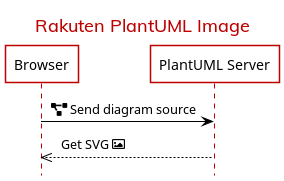

# plantuml-docker

Docker image for running a PlantUML server.

## Differences with the official image

The differences with [plantuml/plantuml-server](https://hub.docker.com/r/plantuml/plantuml-server) are:

- Based on **Alpine Linux**, not Debian.
- Runs on the **Zulu OpenJDK**.
- **`PLANTUML_LIMIT_SIZE`** raised to `16384` so you can generate bigger diagrams.
- Comes with a few fonts:
  - **[Mulish](https://fonts.google.com/specimen/Mulish)** is installed and poses as the **Rakuten Sans** font, which it is visually similar to (and a decent fallback for when generating PNG diagrams).
  - **[Noto Sans](https://fonts.google.com/specimen/Noto+Sans)** and [Noto Sans JP](https://fonts.google.com/specimen/Noto+Sans+JP), recommended by the [ReX typography guidelines](http://rex.public.rakuten-it.com/design/the-basics/typography/). **Noto Sans** is set as the default `sans-serif` font.
  - **[Fira Code](https://fonts.google.com/specimen/Fira+Code)**, set as the default `monospace` font.

## Usage

